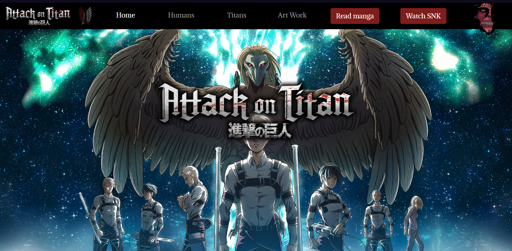
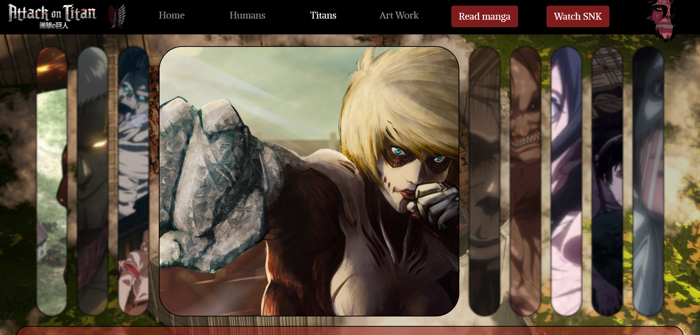
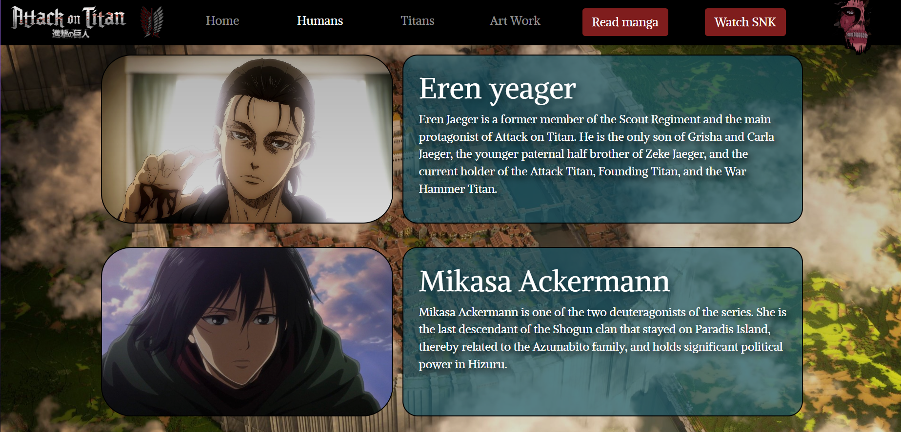
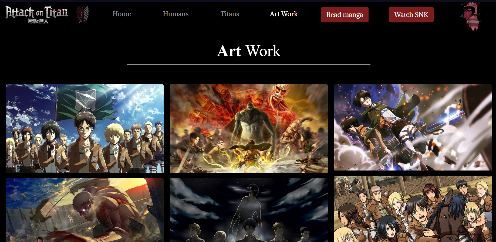

# SNK Fan Website
This is a fan website dedicated to the anime/manga series "Attack on Titan" (also known as "Shingeki no Kyojin" or "SNK"). The website provides an overview of the anime/manga, a page about the nine titans, a page about the main characters, and an art gallery page. The website is built using HTML, CSS, and JavaScript.

## Overview
The Overview page provides a brief summary of the plot and themes of the anime/manga. It also includes information about the creator, Hajime Isayama, and the history of the series.
|                    Main page                    |
| :---------------------------------------------: |
|  |
## Titans
The Titans page provides information about the nine titans that appear in the series. Each titan is presented with an image, a brief description, and their abilities. The page also includes a brief explanation of the titan shifters and their importance in the story.
|                    Titans page                    |
| :---------------------------------------------: |
|  |

## Characters
The Characters page provides a list of the main characters in the series. Each character is presented with an image, a brief description, and their role in the story. The page also includes a brief explanation of the factions and organizations that play a significant role in the series.
|                    Humans page                    |
| :---------------------------------------------: |
|  |

## Art Gallery
The Art Gallery page provides a collection of high-quality images and fan art related to the series. The page includes a slideshow of images and the ability to download or share the images on social media.
|                    Main page                    |
| :---------------------------------------------: |
|  |
## Conclusion
This fan website provides a comprehensive overview of the "Attack on Titan" series, including information about the titans, main characters, and an art gallery. The website is designed using HTML, CSS, and JavaScript to provide an interactive and visually appealing experience for fans of the series.

### [Snk website](https://khalil-hamidani.github.io/SNK/)
